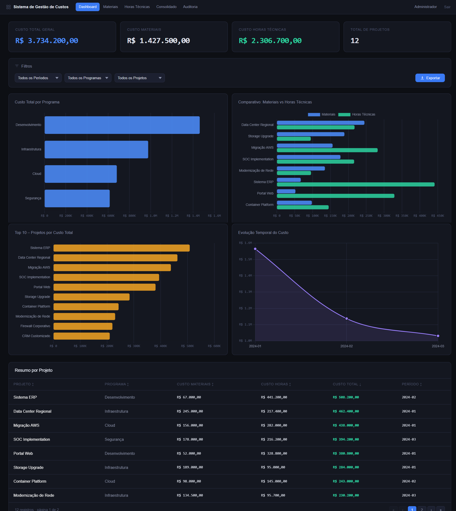
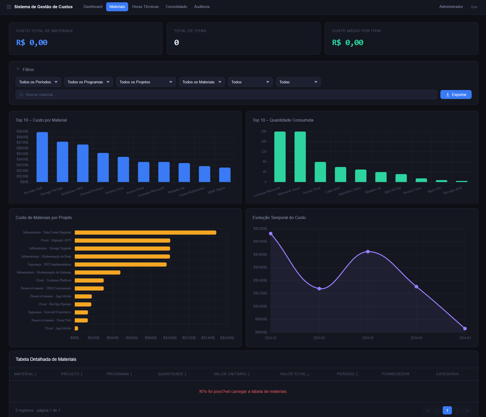
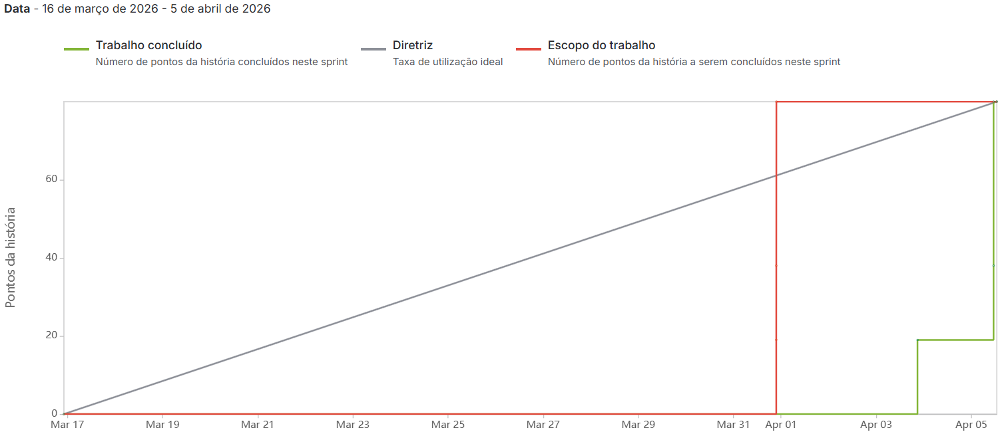
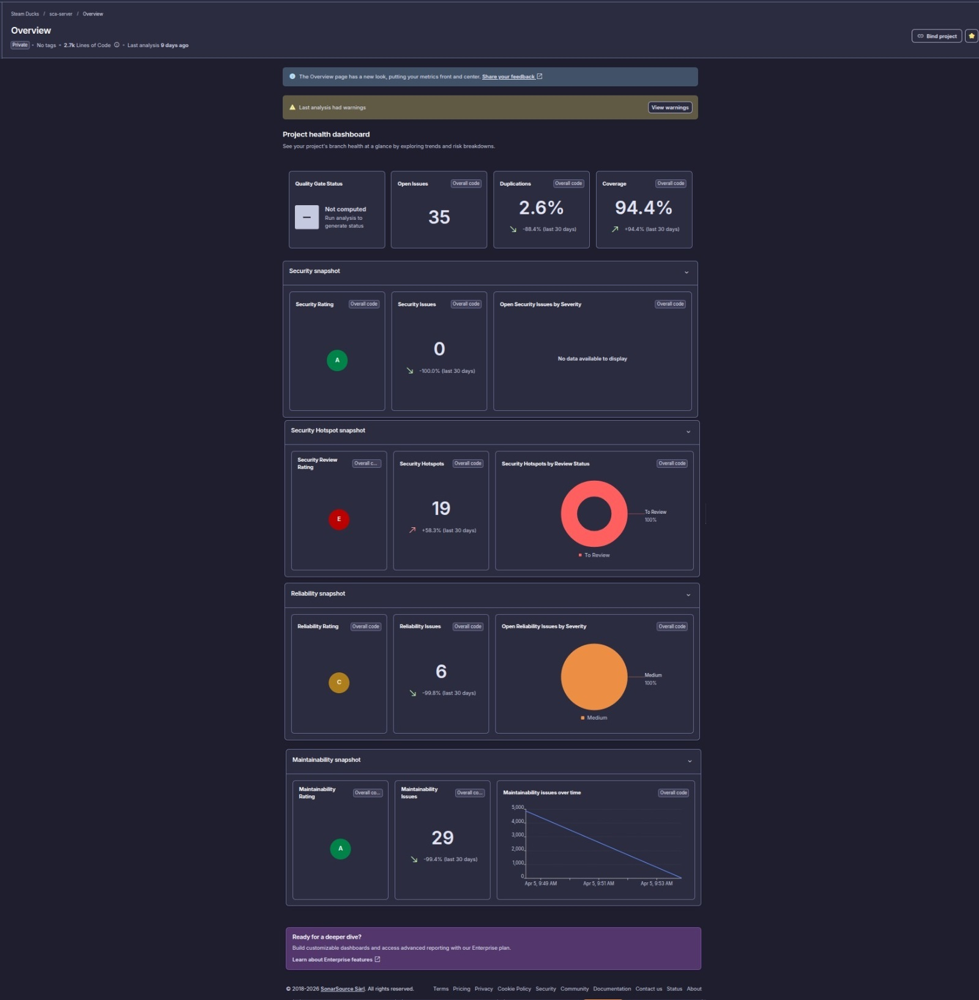

# Sprint 1 Backlog

## Sprint
**Sprint 1**  
**Period:** 03/16/2026 to 04/05/2026

---

## Sprint Goal
Deliver the initial structure of the analytical solution, including the first functional version of the main dashboard and the materials analytics screen.

---

## Sprint User Stories

---

### US04 — Main Dashboard Structure

**User Story**  
As a manager, I want to view the base structure of the main cost dashboard so that I can access the initial navigation and strategic components of the executive view.

**Description**  
Provide the foundational layout of the main dashboard, including indicators, charts, filters, and summary table.

**Definition of Ready (DoR)**
- Dashboard structure defined  
- Wireframe validated  
- Required data sources identified  

**Definition of Done (DoD)**
- Dashboard base layout implemented  
- Core sections (cards, charts, filters, table) working  
- Error and empty states implemented  
- Integrated with backend  
- Tests executed and approved  

**Tasks**
- Create PostgreSQL staging tables for dashboard data  
- Implement data extraction via API into the staging layer  
- Implement data transformation into dimensional model  
- Create graphics section  
- Create filters section  
- Create cards section  
- Create summary table  
- Implement error handling  

---

### US08 — Consolidated Cost View

**User Story**  
As a manager, I want to view the consolidated total cost so that I can quickly understand the total value associated with the analyzed projects.

**Description**  
Provide a consolidated dashboard view combining material and labor costs.

**Definition of Ready (DoR)**
- Consolidation logic defined  
- Data sources available  
- Dashboard structure defined  

**Definition of Done (DoD)**
- Consolidated dashboard implemented  
- Filters working  
- Cards, charts, and table implemented  
- Error handling implemented  
- Data validated  

**Tasks**
- Create graphics section  
- Create filters  
- Create cards  
- Create summary table  
- Implement error handling  

---

### US16 — Materials Analytics Structure

**User Story**  
As an analyst, I want to view the base structure of the materials analytics screen so that I can access an organized view of material consumption and costs.

**Description**  
Provide the base structure for the materials analytics page.

**Definition of Ready (DoR)**
- Materials screen structure defined  
- Required data identified  
- Wireframe validated  

**Definition of Done (DoD)**
- Materials dashboard structure implemented  
- Charts, filters, cards, and table created  
- Error handling implemented  
- UI validated  

**Tasks**
- Create graphics section  
- Create filters  
- Create cards  
- Create summary table  
- Implement error handling  

---

## Evidence

### Wireframes
- [Dashboard Wireframe](https://www.figma.com/make/v1S1QcC1TETZXjW7fsROmZ/Minimalist-Dashboard?p=f&t=rTUNyg9AzobuhCrQ-0&fullscreen=1&preview-route=%2Fdashboard)

#### Dashboard

#### Materials Screen

### Quality and Monitoring
#### Burndown

#### SonarQube

### Presentation
- [Sprint 1 Presentation](../../assets/sprint-1/sprint-presentation-1.pdf)

### Demo Video
- [Assistir Demo - Sprint 1](https://youtu.be/tK6LrtMTIPs)

---

## Sprint Summary

- Completed User Stories: 3  
- Completed Tasks: 19  
- Delivered Story Points: 80  

---

## Sprint Status
**Completed**