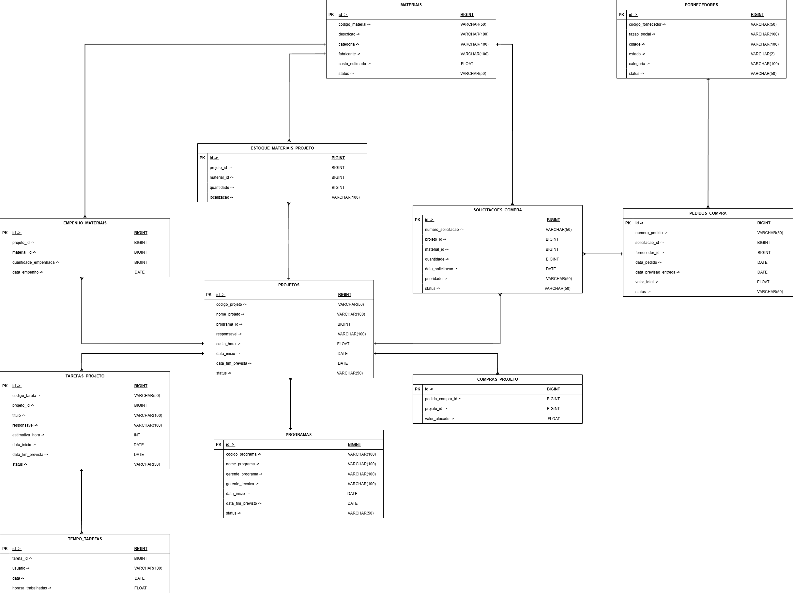

# Database Model

This document describes the analytical database structure adopted in the SCARS project.

The solution uses a **dimensional model** designed to consolidate strategic cost data related to programs, projects, materials, technical hours, purchases, inventory, budget, and financial health.

The model was designed to support analytical queries, dashboards, drill-down navigation, and historical analysis.

---

## Overview

The database structure is based on:

- **PostgreSQL** as the main database
- **Dimensional modeling**
- **Star Schema** with some **Snowflake** characteristics
- **Staging layer** for raw imported data
- **Analytical layer** composed of fact and dimension tables

The purpose of this model is to support multidimensional analysis of:

- program costs
- project costs
- material consumption
- technical hours
- budget
- financial health indicators

---

## Model Diagram

> Add the model image below when available.

---

## Main Dimensions

### `DIM_PROGRAMA`
Stores program-level information.

| Column | Type | Description |
|---|---|---|
| `programa_sk` | BIGINT PK | Surrogate key |
| `programa_nk` | VARCHAR(50) | Natural key from source system |
| `codigo_programa` | VARCHAR(50) | Program code |
| `nome_programa` | VARCHAR(255) | Program name |
| `gerente_programa` | VARCHAR(255) | Executive manager |
| `gerente_tecnico` | VARCHAR(255) | Technical manager |
| `budget_exercicio` | NUMERIC(14,2) | Program budget for the fiscal period |
| `data_inicio` | DATE | Start date |
| `data_fim_prevista` | DATE | Planned end date |
| `status` | VARCHAR(50) | Program status |

---

### `DIM_PROJETO`
Stores project-level information.

| Column | Type | Description |
|---|---|---|
| `projeto_sk` | BIGINT PK | Surrogate key |
| `projeto_nk` | VARCHAR(50) | Natural key from source |
| `codigo_projeto` | VARCHAR(50) | Project code |
| `nome_projeto` | VARCHAR(255) | Project name |
| `programa_sk` | BIGINT FK | Reference to program |
| `responsavel` | VARCHAR(255) | Project owner |
| `custo_hora_padrao` | NUMERIC(12,2) | Default technical hour cost |
| `data_inicio` | DATE | Start date |
| `data_fim_prevista` | DATE | Planned end date |
| `status` | VARCHAR(50) | Project status |

---

### `DIM_TEMPO`
Stores the time dimension generated during ETL.

| Column | Type | Description |
|---|---|---|
| `tempo_sk` | INTEGER PK | Time surrogate key |
| `data` | DATE | Full date |
| `dia` | INTEGER | Day of month |
| `mes` | INTEGER | Month number |
| `nome_mes` | VARCHAR(20) | Month name |
| `trimestre` | INTEGER | Quarter |
| `ano` | INTEGER | Year |

---

### `DIM_MATERIAL`
Stores material-related information.

| Column | Type | Description |
|---|---|---|
| `material_sk` | BIGINT PK | Surrogate key |
| `material_nk` | VARCHAR(50) | Natural key |
| `codigo_material` | VARCHAR(50) | Material code |
| `descricao` | TEXT | Material description |
| `categoria` | VARCHAR(100) | Material category |
| `fabricante` | VARCHAR(255) | Manufacturer |
| `custo_estimado` | NUMERIC(14,4) | Reference estimated cost |
| `status` | VARCHAR(50) | Material status |

---

### `DIM_FORNECEDOR`
Stores supplier information.

| Column | Type | Description |
|---|---|---|
| `fornecedor_sk` | BIGINT PK | Surrogate key |
| `fornecedor_nk` | VARCHAR(50) | Natural key |
| `codigo_fornecedor` | VARCHAR(50) | Supplier code |
| `razao_social` | VARCHAR(255) | Supplier legal name |
| `cidade` | VARCHAR(100) | City |
| `estado` | VARCHAR(2) | State |
| `categoria` | VARCHAR(100) | Supplier category |
| `status` | VARCHAR(50) | Supplier status |

---

### `DIM_COLABORADOR`
Stores collaborator information derived from time entries.

| Column | Type | Description |
|---|---|---|
| `colaborador_sk` | BIGINT PK | Surrogate key |
| `colaborador_nk` | VARCHAR(100) | Natural key |
| `nome_usuario` | VARCHAR(100) | System username |

---

### `DIM_TAREFA`
Stores project task information.

| Column | Type | Description |
|---|---|---|
| `tarefa_sk` | BIGINT PK | Surrogate key |
| `tarefa_nk` | VARCHAR(50) | Natural key |
| `codigo_tarefa` | VARCHAR(50) | Task code |
| `projeto_sk` | BIGINT FK | Reference to project |
| `titulo` | TEXT | Task title |
| `responsavel` | VARCHAR(255) | Task owner |
| `estimativa_horas` | NUMERIC(10,2) | Estimated hours |
| `data_inicio` | DATE | Start date |
| `data_fim_prevista` | DATE | Planned end date |
| `status` | VARCHAR(50) | Task status |

---

### `DIM_PEDIDO_COMPRA`
Stores purchase order information.

| Column | Type | Description |
|---|---|---|
| `pedido_compra_sk` | BIGINT PK | Surrogate key |
| `pedido_compra_nk` | VARCHAR(50) | Natural key |
| `numero_pedido` | VARCHAR(50) | Purchase order number |
| `solicitacao_compra_sk` | BIGINT FK | Originating purchase request |
| `fornecedor_sk` | BIGINT FK | Supplier reference |
| `data_pedido` | DATE | Order date |
| `data_previsao_entrega` | DATE | Planned delivery date |
| `valor_total_pedido` | NUMERIC(14,2) | Total order value |
| `status` | VARCHAR(50) | Purchase order status |

---

### `DIM_SOLICITACAO_COMPRA`
Stores purchase request information.

| Column | Type | Description |
|---|---|---|
| `solicitacao_compra_sk` | BIGINT PK | Surrogate key |
| `solicitacao_compra_nk` | VARCHAR(50) | Natural key |
| `numero_solicitacao` | VARCHAR(50) | Request number |
| `projeto_sk` | BIGINT FK | Requesting project |
| `material_sk` | BIGINT FK | Requested material |
| `data_solicitacao` | DATE | Request date |
| `prioridade` | VARCHAR(50) | Priority |
| `status` | VARCHAR(50) | Request status |

---

### `DIM_LOCAL_ESTOQUE`
Stores stock location information.

| Column | Type | Description |
|---|---|---|
| `local_estoque_sk` | BIGINT PK | Surrogate key |
| `local_estoque_nk` | VARCHAR(100) | Natural key |
| `localizacao` | VARCHAR(255) | Physical stock location |

---

## Main Fact Tables

### `FATO_CONSUMO_MATERIAL`
Stores material commitment or consumption events by project and date.

| Column | Type | Description |
|---|---|---|
| `consumo_id` | BIGINT PK | Event identifier |
| `tempo_sk` | INTEGER FK | Time reference |
| `projeto_sk` | BIGINT FK | Project reference |
| `material_sk` | BIGINT FK | Material reference |
| `quantidade_consumida` | NUMERIC(14,4) | Quantity consumed |
| `custo_unitario_referencia` | NUMERIC(14,4) | Reference unit cost |
| `custo_total_material_estimado` | NUMERIC(14,2) | Estimated total material cost |
| `source_system` | VARCHAR(50) | Source system |
| `source_record_id` | VARCHAR(50) | Original record id |
| `load_dttm` | TIMESTAMP | Load timestamp |

**Grain:** one row per material commitment/consumption event by project and date.

---

### `FATO_HORAS_TECNICAS`
Stores technical hours worked by task, collaborator, and date.

| Column | Type | Description |
|---|---|---|
| `horas_id` | BIGINT PK | Event identifier |
| `tempo_sk` | INTEGER FK | Time reference |
| `projeto_sk` | BIGINT FK | Project reference |
| `tarefa_sk` | BIGINT FK | Task reference |
| `colaborador_sk` | BIGINT FK | Collaborator reference |
| `horas_trabalhadas` | NUMERIC(10,2) | Worked hours |
| `custo_hora` | NUMERIC(12,2) | Applied hourly cost |
| `custo_total_horas` | NUMERIC(14,2) | Total hours cost |
| `source_system` | VARCHAR(50) | Source system |
| `source_record_id` | VARCHAR(50) | Original record id |
| `load_dttm` | TIMESTAMP | Load timestamp |

**Grain:** one row per hours entry by task, collaborator, and date.

---

### `FATO_COMPRA_PROJETO`
Stores purchase allocation by project.

| Column | Type | Description |
|---|---|---|
| `compra_projeto_id` | BIGINT PK | Fact identifier |
| `projeto_sk` | BIGINT FK | Project reference |
| `pedido_compra_sk` | BIGINT FK | Purchase order reference |
| `solicitacao_compra_sk` | BIGINT FK | Purchase request reference |
| `tempo_sk` | INTEGER FK | Reference date |
| `fornecedor_sk` | BIGINT FK | Supplier reference |
| `valor_alocado` | NUMERIC(14,2) | Allocated value |
| `source_system` | VARCHAR(50) | Source system |
| `source_record_id` | VARCHAR(50) | Original record id |
| `load_dttm` | TIMESTAMP | Load timestamp |

**Grain:** one row per purchase allocation to project.

---

### `FATO_ESTOQUE_PROJETO`
Stores stock position snapshots by project and date.

| Column | Type | Description |
|---|---|---|
| `estoque_id` | BIGINT PK | Fact identifier |
| `projeto_sk` | BIGINT FK | Project reference |
| `material_sk` | BIGINT FK | Material reference |
| `local_estoque_sk` | BIGINT FK | Stock location reference |
| `tempo_sk` | INTEGER FK | Reference date |
| `quantidade_estoque` | NUMERIC(14,4) | Stock quantity |
| `source_system` | VARCHAR(50) | Source system |
| `source_record_id` | VARCHAR(50) | Original record id |
| `load_dttm` | TIMESTAMP | Load timestamp |

**Grain:** one row per stock position by project, material, location, and date.

---

### `FATO_SOLICITACAO_COMPRA`
Stores material purchase requests by project.

| Column | Type | Description |
|---|---|---|
| `solicitacao_fato_id` | BIGINT PK | Fact identifier |
| `solicitacao_compra_sk` | BIGINT FK | Purchase request reference |
| `tempo_sk` | INTEGER FK | Request date |
| `projeto_sk` | BIGINT FK | Project reference |
| `material_sk` | BIGINT FK | Material reference |
| `quantidade_solicitada` | NUMERIC(14,4) | Requested quantity |
| `source_system` | VARCHAR(50) | Source system |
| `source_record_id` | VARCHAR(50) | Original record id |
| `load_dttm` | TIMESTAMP | Load timestamp |

**Grain:** one row per purchase request event.

---

### `FATO_BUDGET_PROJETO`
Stores budget values by program and project.

| Column | Type | Description |
|---|---|---|
| `budget_projeto_id` | BIGINT PK | Fact identifier |
| `tempo_sk` | INTEGER FK | Time reference |
| `programa_sk` | BIGINT FK | Program reference |
| `projeto_sk` | BIGINT FK | Project reference |
| `valor_budget_programa` | NUMERIC(14,2) | Program budget |
| `valor_budget_projeto` | NUMERIC(14,2) | Estimated project budget |
| `criterio_distribuicao` | VARCHAR(100) | Distribution rule |
| `source_system` | VARCHAR(50) | Source system |
| `source_record_id` | VARCHAR(50) | Logical source identifier |
| `load_dttm` | TIMESTAMP | Load timestamp |

**Grain:** one row per project by budget reference period.

---

### `FATO_SAUDE_FINANCEIRA_PROJETO`
Stores financial health metrics by project and period.

| Column | Type | Description |
|---|---|---|
| `saude_financeira_id` | BIGINT PK | Fact identifier |
| `tempo_sk` | INTEGER FK | Calculation period |
| `programa_sk` | BIGINT FK | Program reference |
| `projeto_sk` | BIGINT FK | Project reference |
| `custo_total_real` | NUMERIC(14,2) | Total real cost |
| `custo_total_material` | NUMERIC(14,2) | Material cost portion |
| `custo_total_horas` | NUMERIC(14,2) | Technical hours cost portion |
| `valor_budget_projeto` | NUMERIC(14,2) | Project budget |
| `desvio_percentual` | NUMERIC(7,2) | Percentage deviation |
| `classificacao_saude` | VARCHAR(30) | Financial health classification |
| `projecao_estouro` | NUMERIC(14,2) | Projected overrun |
| `source_system` | VARCHAR(50) | Source system |
| `source_record_id` | VARCHAR(50) | Logical source identifier |
| `load_dttm` | TIMESTAMP | Load timestamp |

**Grain:** one row per project and financial calculation period.

---

## Main Business Rules

### Program and Project
- Each project belongs to one single program in the current scope.
- A program may be closed while some related projects remain active.

### Materials
- Material cost must be considered based on committed quantity.
- If no effective cost is available, estimated reference cost may be used.

### Technical Hours
- Technical hours cost is calculated from worked hours and hourly cost.
- When no individual employee hourly rate is available, the project default hourly cost is used.

### Consolidated Cost
The official consolidated project cost must be calculated from:

- `FATO_CONSUMO_MATERIAL`
- `FATO_HORAS_TECNICAS`

The following tables do **not** directly compose consolidated real cost:

- `FATO_COMPRA_PROJETO`
- `FATO_SOLICITACAO_COMPRA`
- `FATO_ESTOQUE_PROJETO`

### Budget and Financial Health
- `FATO_BUDGET_PROJETO` stores budget reference values.
- `FATO_SAUDE_FINANCEIRA_PROJETO` stores financial health metrics.
- Financial health classification follows this rule:
  - below 70% = Healthy
  - 70% to 90% = Attention
  - 90% or above = Critical

---

## Main Relationships

- `DIM_PROGRAMA` 1:N `DIM_PROJETO`
- `DIM_PROJETO` 1:N `DIM_TAREFA`
- `DIM_SOLICITACAO_COMPRA` 1:N `DIM_PEDIDO_COMPRA`

- `DIM_PROJETO` 1:N `FATO_CONSUMO_MATERIAL`
- `DIM_PROJETO` 1:N `FATO_HORAS_TECNICAS`
- `DIM_PROJETO` 1:N `FATO_COMPRA_PROJETO`
- `DIM_PROJETO` 1:N `FATO_ESTOQUE_PROJETO`
- `DIM_PROJETO` 1:N `FATO_SOLICITACAO_COMPRA`
- `DIM_PROJETO` 1:N `FATO_BUDGET_PROJETO`
- `DIM_PROJETO` 1:N `FATO_SAUDE_FINANCEIRA_PROJETO`

- `DIM_TEMPO` 1:N all time-based fact tables
- `DIM_MATERIAL` 1:N material-related fact tables
- `DIM_FORNECEDOR` 1:N supplier-related dimensions and facts
- `DIM_TAREFA` 1:N `FATO_HORAS_TECNICAS`
- `DIM_COLABORADOR` 1:N `FATO_HORAS_TECNICAS`
- `DIM_LOCAL_ESTOQUE` 1:N `FATO_ESTOQUE_PROJETO`

---

## Source Files Used in the Current Scope

The current project scope uses CSV files as the official source for ETL and analytical loading.

Main source files include:

- `compras_projetos`
- `empenho_materiais`
- `estoque_materias_projeto`
- `fornecedores`
- `materiais`
- `pedidos_compra`
- `programas`
- `projetos`
- `solicitacoes_compra`
- `tarefas_projeto`
- `tempo_tarefas`

---